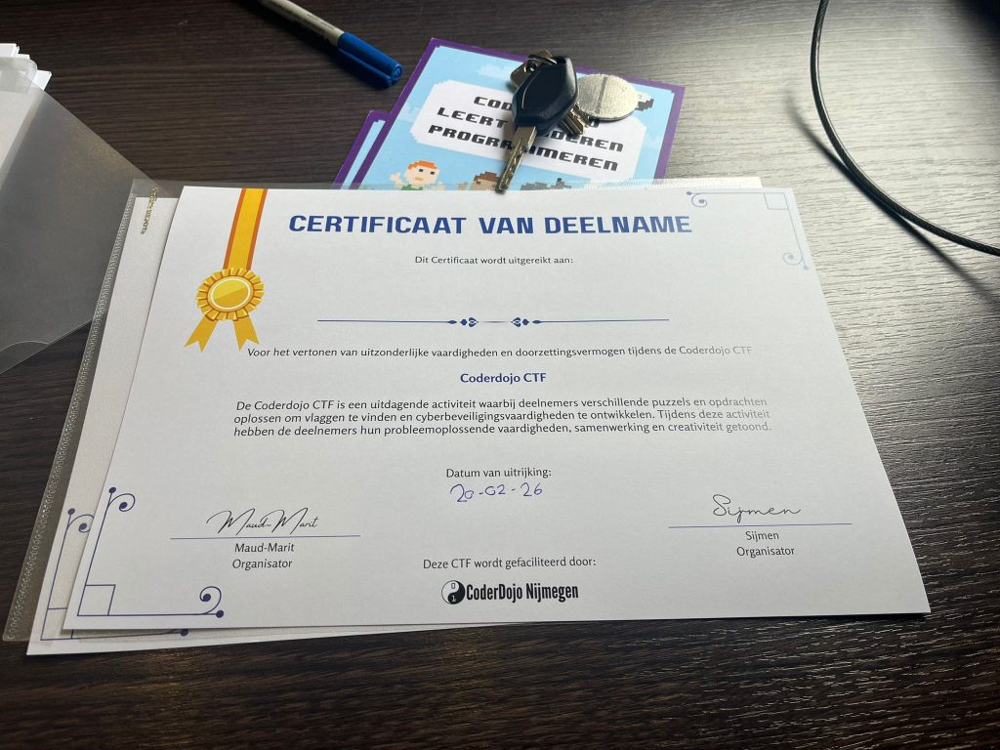



Wat waren dit twee mooie dagen voor CoderDojo.  
Samen met het mobiele medialab van de Politie, in samenwerking met HackShield en de gemeente Nijmegen, trokken we door
Nijmegen om jongeren op een interactieve manier kennis te laten maken met digitale veiligheid.

<!--more-->

Vanuit CoderDojo lag de focus sterk op onze (vernieuwde) hackopdrachten. De kinderen gingen actief aan de slag met
verschillende challenges waarin ze leerden denken als een hacker, maar dan natuurlijk als een ethische hacker. De
opdrachten zijn doorontwikkeld en sloten mooi aan bij verschillende leeftijden en niveaus. Door zowel HackShield als
onze eigen hackchallenges aan te bieden, was er voor ieder wat wils: toegankelijk en speels voor de jongste deelnemers,
en extra uitdagend voor de oudere kinderen die echt de diepte in wilden.

De energie was aanstekelijk. Twee drukke dagen vol nieuwsgierigheid, samenwerking en trotse gezichten. Als kers op de
taart ontvingen alle deelnemers een officieel hackerscertificaat! Een tastbare herinnering aan hun nieuwe skills en
inzet.

Wij kijken met trots terug en zien nu al uit naar 4 april, wanneer we opnieuw samen met de politie op pad mogen om nóg
meer jonge hackers te inspireren.

